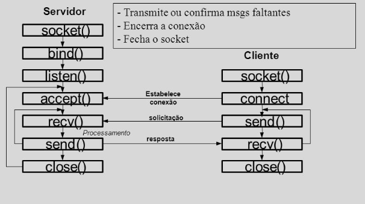

Conteúdo
==================

* [Pré-requisito](#Pré-requisito)
* [O que é socket](#O-que-é-socket)
* [Principais método](#Principais-método)
    * [Método de um objeto socket](#Método-de-um-objeto-socket)
* [Interface de sockets](#Interface-de-sockets)
* [Estrutura](#Estrutura)
</br></br>

# Pré-requisito
Instalar o [python3](https://www.python.org/downloads/)
```bash

# Instalação
sudo apt install python3.8

# Verificando a versão
python3.8 --version
```

</br></br>

# O que é socket
<p>Sockets (soquetes) são empregados para o envio de mensagens através de uma rede. São uma dos formas mais comuns de IPC - Internet-Process Communication</p>

<p>O mósulo socket do Python fornece uma interface para a API do sockets BSD.</p>

</br></br>

# Principais métodos e funções

<table>
    <tr>
    <td>socket()</td> <td>connect_ex()</td>
    </tr>
    <tr>
    <td>bind()</td> <td>send()</td>
    </tr>
    <tr>
    <td>listen()</td> <td>recv()</td>
    </tr>
    <tr>
    <td>accept()</td> <td>close()</td>
    </tr>
     <tr>
    <td>connect()</td>
    </tr>
</table>

</br></br>

# Métodos de um objeto socket

- accept(): Aceita uma conexão de cliente

- bind(endereço): Associa o socket servidor a um endereço

- close(): Fecha um socket, liberando todos os recursos alocados.

- connect(endereço): Conecta um cliente a um endereço.

- connect_ex(endereço): Idem anterior, retornando um indicador de erro, em vez de uma exceção, na ocorrência da chamada do connect em baixo nível. 

</br></br>

# Interface de sockets

</br></br>

# Estrutura

<h1 align="center">
    
</h1>

# Execução

- Servidor
```bash
python3 servidor.py
```
- Cliente
```bash
python3 cliente.py
```